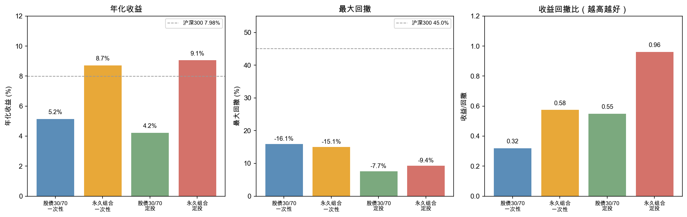
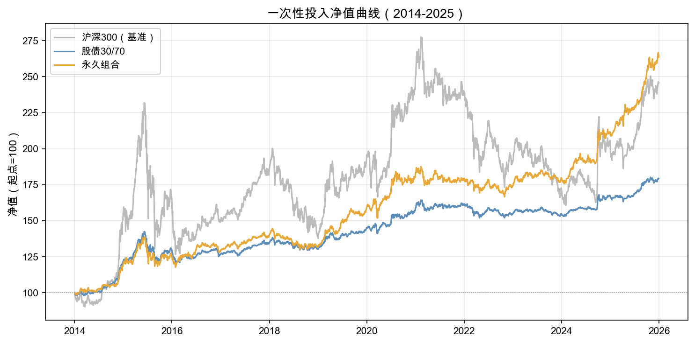
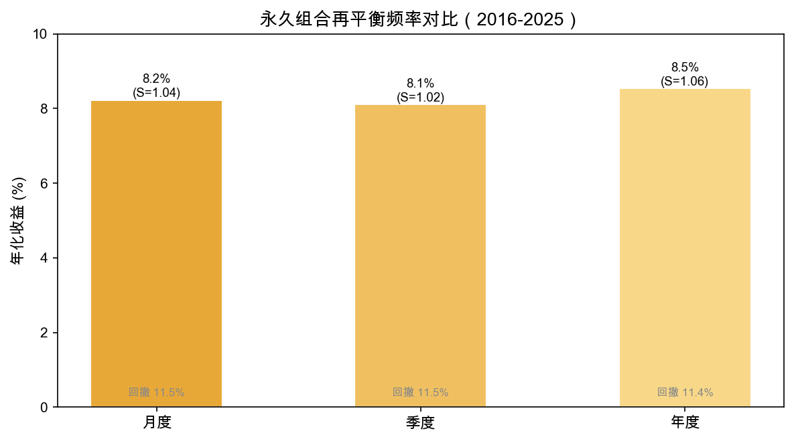
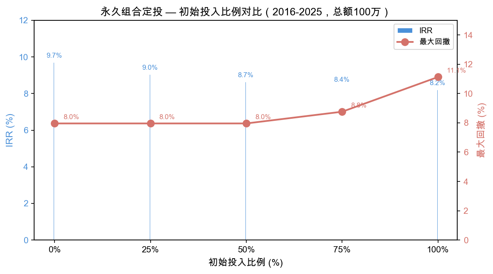

# A 股资产配置回测报告

> 2014-01-01 ~ 2025-12-31，共 12 年，数据来源 yfinance（复权价格），佣金万十，无风险利率 2.5%

## 核心结论

**对于 A 股普通投资者，最优配置是：**

1. **永久组合**（沪深300 + 国债ETF + 黄金ETF，各 1/3），**月度再平衡**
2. 配合**定投**（纯定投，不一次性投入），总额 100 万，按月投入

这样做的效果：
- 年化 **9.1%**（跑赢沪深300的 8.0%）
- 最大回撤仅 **-9.4%**（沪深300 为 -45.0%，回撤降低 **79%**）
- 100 万定投 12 年，期末 **174 万**，总收益 +74%

---

## 一、四策略总览

我们测试了两种策略 × 两种投入方式的组合：



| 策略 | 投入方式 | 年化收益 | 最大回撤 | 收益回撤比 | 跑赢沪深300 |
|------|---------|---------|---------|-----------|------------|
| 股债 30/70 | 一次性 | 5.17% | -16.1% | 0.32 | ❌ |
| **永久组合** | **一次性** | **8.74%** | -15.1% | **0.58** | ✅ |
| 股债 30/70 | 定投 | 4.25% | -7.7% | 0.55 | ❌ |
| **永久组合** | **定投** | **9.09%** | **-9.4%** | **0.97** | ✅ |

**永久组合全面碾压股债平衡**——收益更高、回撤更低、跑赢基准。

---

## 二、黄金是关键

为什么永久组合（加黄金）远好于股债平衡？



- 沪深300 过去 12 年几乎原地踏步（灰色线），中间经历了 2015 股灾、2018 贸易战、2022 疫情
- 股债 30/70（蓝色线）靠国债平滑了波动，但收益只比沪深300好一点点
- 永久组合（橙色线）加了黄金后，在股市下跌时黄金往往上涨（如 2020、2022），起到了真正的对冲作用

---

## 三、滚动窗口验证：三个 10 年都跑赢

策略好不好，不能只看一个时间段。我们用 3 个不重叠的 10 年窗口验证：


| 窗口 | 永久组合 | 沪深300 | 超额 | 永久组合回撤 | 沪深300回撤 |
|------|---------|---------|------|------------|------------|
| 2014-2023 | 6.06% | 5.73% | +0.3% | -15.6% | -45.0% |
| 2015-2024 | 5.90% | 2.68% | +3.2% | -15.6% | -44.7% |
| 2016-2025 | 8.23% | 4.99% | +3.2% | -11.5% | -41.3% |

**3 个窗口全部跑赢基准**，年化稳定在 5.9%~8.2%。

而股债 30/70 在同样 3 个窗口中，只有 1 个跑赢基准——**差距全在黄金**。

---

## 四、多久调一次仓？



| 频率 | 年化 | 回撤 | Sortino | 操作难度 |
|------|------|------|---------|---------|
| **月度** | 8.23% | -11.5% | 1.04 | 定投时顺便做 |
| 季度 | 8.11% | -11.5% | 1.02 | 每季看一次 |
| 年度 | 8.54% | -11.4% | 1.06 | 最省心 |

**结论：月度再平衡回撤控制最好，年度最省心，三者差异不大。** 推荐月度——如果你已经在定投，每次定投时顺便把比例调回 1/3 即可，不增加额外操作。

---

## 五、定投 vs 一次性投入



以 2016-2025 窗口为例，总额 100 万，不同初始投入比例的效果：

| 初始投入 | IRR | 最大回撤 | 总收益 |
|---------|-----|---------|--------|
| **0%（纯定投）** | **9.70%** | **-8.0%** | +62 万 |
| 25% | 9.04% | -8.0% | +75 万 |
| 50% | 8.65% | -8.0% | +88 万 |
| 75% | 8.40% | -8.8% | +101 万 |
| 100%（一次性） | 8.22% | -11.1% | +114 万 |

**纯定投回撤最低（-8.0%），IRR 最高（9.70%）。**

- 一次性投入总收益更高（114 万 vs 62 万），但那是后视镜——你需要猜对买入时机
- 定投分批买入摊低成本，不择时，回撤只有 -8%，心理压力小得多
- 初始投入越多，总收益越高，但回撤也随之增大

---

## 六、具体怎么执行

### 标的

| 资产 | ETF 代码 | 作用 |
|------|---------|------|
| 沪深300 | 510300.SS | 股票，获取市场收益 |
| 国债ETF | 511010.SS | 债券，稳定压舱石 |
| 黄金ETF | 518880.SS | 黄金，对冲股市下跌 |

### 操作（推荐方式）

1. **每月发工资后**，按 1:1:1 的比例买入三只 ETF
2. 每次买入时，检查一下三只 ETF 的市值比例，如果偏离 1/3 太多就调一调
3. **不需要止损**，不需要择时，不需要盯盘

### 配置文件

项目中提供了 4 个标准配置，可以直接复现所有结果：

```bash
cd /Users/yapex/workspace/backtrader-research
uv sync

# 一次性投入
uv run engine.py --config examples/cn_stockbond.yaml
uv run engine.py --config examples/cn_permanent.yaml

# 定投
uv run engine.py --config examples/cn_stockbond_dca.yaml
uv run engine.py --config examples/cn_permanent_dca.yaml
```

---

## 数据说明

- **数据来源**：yfinance，A 股 ETF 使用复权价格（含分红），基准为沪深300
- **佣金**：万十（0.1%），与实际交易成本一致
- **回测期**：2014-01-01 ~ 2025-12-31（12 年）
- **滚动验证**：3 个不重叠的 10 年窗口（2014-2023、2015-2024、2016-2025）
- **评分指标**：年化收益、最大回撤、Sortino 比率、IRR（定投）
