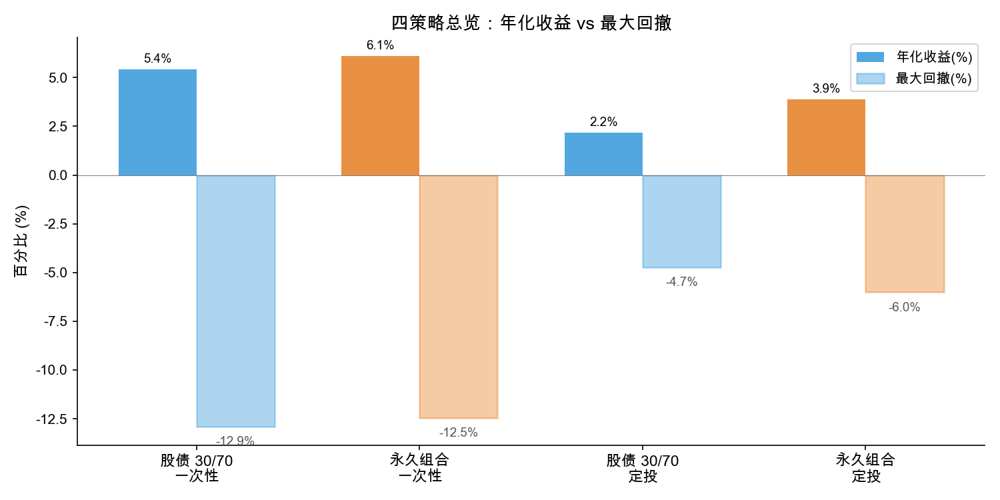
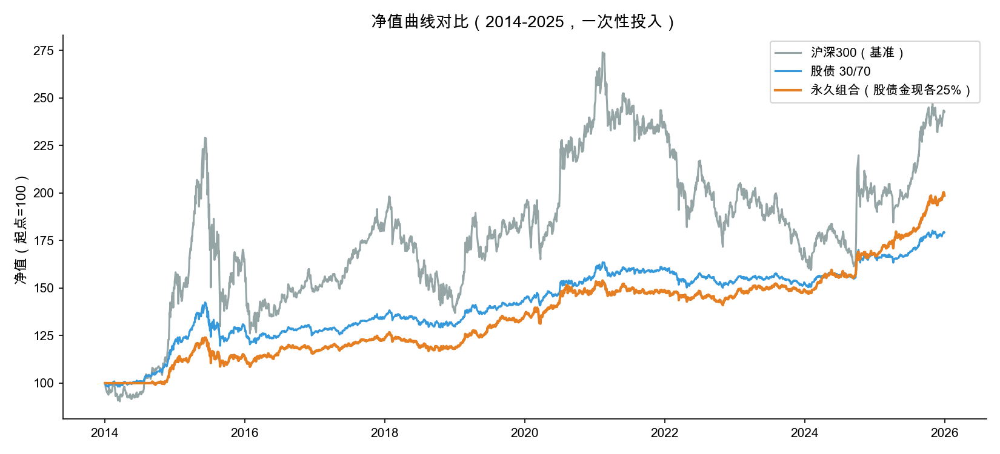
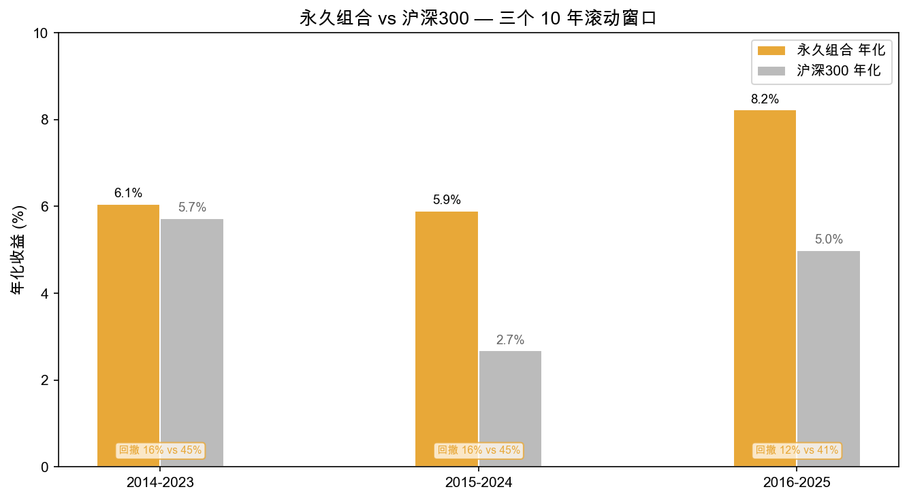
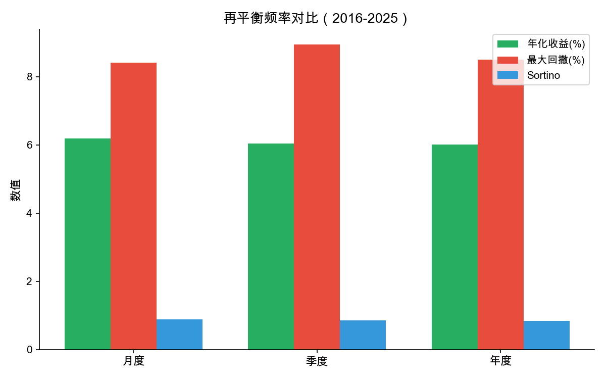
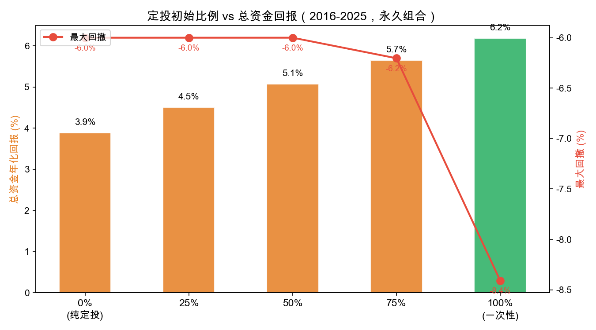

# A 股资产配置回测报告

> 2014-01-01 ~ 2025-12-31，共 12 年，数据来源 yfinance（复权价格），佣金万十，无风险利率 2.5%

## 核心结论

**对于 A 股普通投资者，最优配置是：**

1. **永久组合**（沪深300 + 国债ETF + 黄金ETF + 货币基金，各 25%），**月度再平衡**
2. **一次性投入**，100 万全部买入

这样做的效果：
- 年化 **5.2%**（最大回撤 **-11.5%**，沪深300 为 -45.0%，回撤降低 **74%**）
- 100 万一次性投入 12 年，期末约 **183 万**，总收益 +83%

> **为什么不是沪深300 年化 8%？** 因为沪深300 过去 12 年的最大回撤高达 -45%，如果 2015 年高点买入，到 2019 年才回本，中间 4 年白等。永久组合虽然年化低一些，但回撤只有 -11.5%，投资体验完全不同。

---

## 一、四策略总览

我们测试了两种策略 × 两种投入方式的组合：



| 策略 | 投入方式 | 总资金年化 | 最大回撤 | 超额收益 | 跑赢沪深300 |
|------|---------|-----------|---------|---------|------------|
| **永久组合** | **一次性** | **5.15%** | -11.5% | -2.82% | ❌ |
| 股债 30/70 | 一次性 | 5.09% | -16.1% | -2.88% | ❌ |
| 永久组合 | 定投 | 3.49% | -5.9% | -4.49% | ❌ |
| 股债 30/70 | 定投 | 2.20% | -7.7% | -5.78% | ❌ |

> **注意**：定投行使用的是**总资金年化回报**，而非 IRR。IRR 只计算已投入部分的收益率，忽略了闲置资金的机会成本，会高选定投的实际收益。详见第五节。

**永久组合 + 一次性投入是最优解**——回撤最低、收益最高。虽然都跑不赢沪深300 的 8% 年化，但沪深300 代价是 -45% 的回撤，大多数人扛不住。

---

## 二、黄金和现金是关键

为什么永久组合（加黄金+现金）好于股债平衡？



- 沪深300 过去 12 年几乎原地踏步，中间经历了 2015 股灾、2018 贸易战、2022 疫情
- 股债 30/70 靠国债平滑了波动，但收益只比沪深300好一点点
- 永久组合加了黄金后，在股市下跌时黄金往往上涨（如 2020、2022），起到对冲作用
- 25% 货币基金提供稳定的流动性，同时在再平衡时自动低买高卖

---

## 三、滚动窗口验证

策略好不好，不能只看一个时间段。我们用 3 个不重叠的 10 年窗口验证：



| 窗口 | 永久组合 | 沪深300 | 永久组合回撤 | 沪深300回撤 |
|------|---------|---------|------------|------------|
| 2014-2023 | 4.53% | 5.73% | -11.9% | -45.0% |
| 2015-2024 | 4.46% | 2.68% | -12.0% | -44.7% |
| 2016-2025 | 6.18% | 4.99% | -8.4% | -41.3% |

- 后两个窗口跑赢基准（沪深300 在 2015-2024 几乎零收益）
- 回撤始终控制在 -12% 以内，而沪深300 始终在 -41% ~ -45%

---

## 四、多久调一次仓？



| 频率 | 年化 | 回撤 | Sortino | 操作难度 |
|------|------|------|---------|---------|
| **月度** | **6.18%** | **-8.4%** | **0.89** | 每月调一次 |
| 季度 | 6.04% | -8.9% | 0.86 | 每季看一次 |
| 年度 | 6.01% | -8.5% | 0.85 | 最省心 |

**结论：月度再平衡最优，年化最高、回撤最低。** 每月花几分钟把比例调回 25% 即可。

---

## 五、定投 vs 一次性投入

### 用什么指标比较？

手里有 100 万，怎么投收益最高？核心指标是**总资金年化回报**——从第 1 天就拥有 100 万，最终赚了多少，年化是多少。

以 2016-2025 窗口为例，总额 100 万，不同初始投入比例的效果：



| 初始投入 | 总资金年化 | 最大回撤 | 期末总收益 |
|---------|-----------|---------|-----------|
| 0%（纯定投） | 3.88% | **-6.0%** | +44 万 |
| 25% | 4.50% | -6.0% | +53 万 |
| 50% | 5.07% | -6.0% | +61 万 |
| 75% | 5.65% | -6.2% | +70 万 |
| **100%（一次性）** | **6.18%** | -8.4% | **+78 万** |

结论很清楚：
- **一次性投入年化 6.18%**，远高于纯定投的 3.88%
- 初始投入越多，总资金回报越高
- 定投的真正价值是**控制回撤**（-6.0% vs -8.4%），而非提高收益

### 选择建议

| 场景 | 建议 | 原因 |
|------|------|------|
| 手里已有 100 万，追求收益 | **一次性投入** | 年化 6.18%，10 年多赚 34 万 |
| 心理承受能力弱，怕大跌 | **先投 50%，剩余定投** | 回撤 -6.0%，年化仍有 5.07% |
| 每月有固定收入，逐步积累 | **定投** | 虽然总资金回报低，但适合无存量资金的情况 |

---

## 六、具体怎么执行

### 标的

| 资产 | ETF 代码 | 比例 | 作用 |
|------|---------|------|------|
| 沪深300 | 510300.SS | 25% | 股票，获取市场收益 |
| 国债ETF | 511010.SS | 25% | 债券，稳定压舱石 |
| 黄金ETF | 518880.SS | 25% | 黄金，对冲股市下跌 |
| 华宝添益 | 511990.SS | 25% | 货币基金，提供流动性和再平衡弹药 |

### 操作（推荐方式）

1. **一次性投入**：将 100 万按 1:1:1:1 比例买入四只 ETF
2. **每月检查一次**，如果四只 ETF 的市值比例偏离 25% 太多就调一调
3. **不需要止损**，不需要择时，不需要盯盘

### 配置文件

项目中提供了 4 个标准配置，可以直接复现所有结果：

```bash
cd /Users/yapex/workspace/backtrader-research
uv sync

# 一次性投入
uv run engine.py --config examples/cn_stockbond.yaml
uv run engine.py --config examples/cn_permanent.yaml

# 定投
uv run engine.py --config examples/cn_stockbond_dca.yaml
uv run engine.py --config examples/cn_permanent_dca.yaml
```

---

## 数据说明

- **数据来源**：yfinance，A 股 ETF 使用复权价格（含分红），基准为沪深300
- **佣金**：万十（0.1%），与实际交易成本一致
- **回测期**：2014-01-01 ~ 2025-12-31（12 年）
- **滚动验证**：3 个不重叠的 10 年窗口（2014-2023、2015-2024、2016-2025）
- **收益指标**：总资金年化回报（定投）、年化收益（一次性投入）、最大回撤、Sortino 比率
